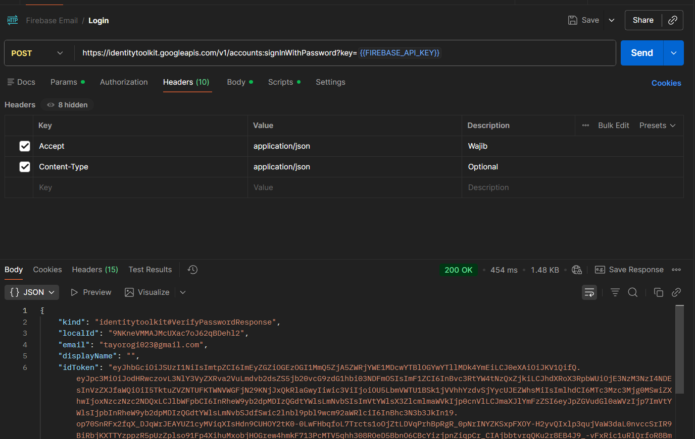
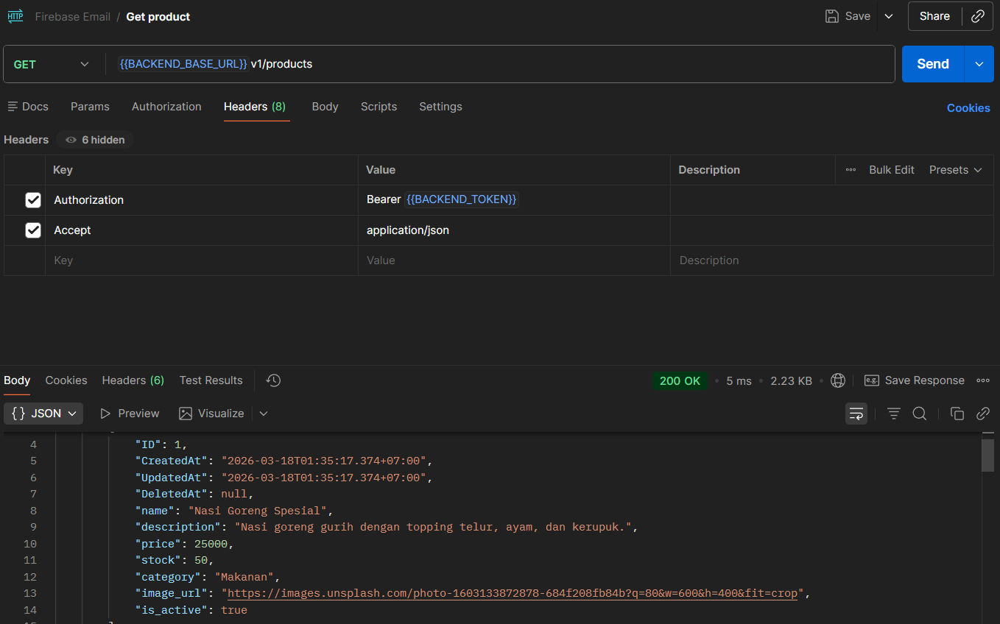
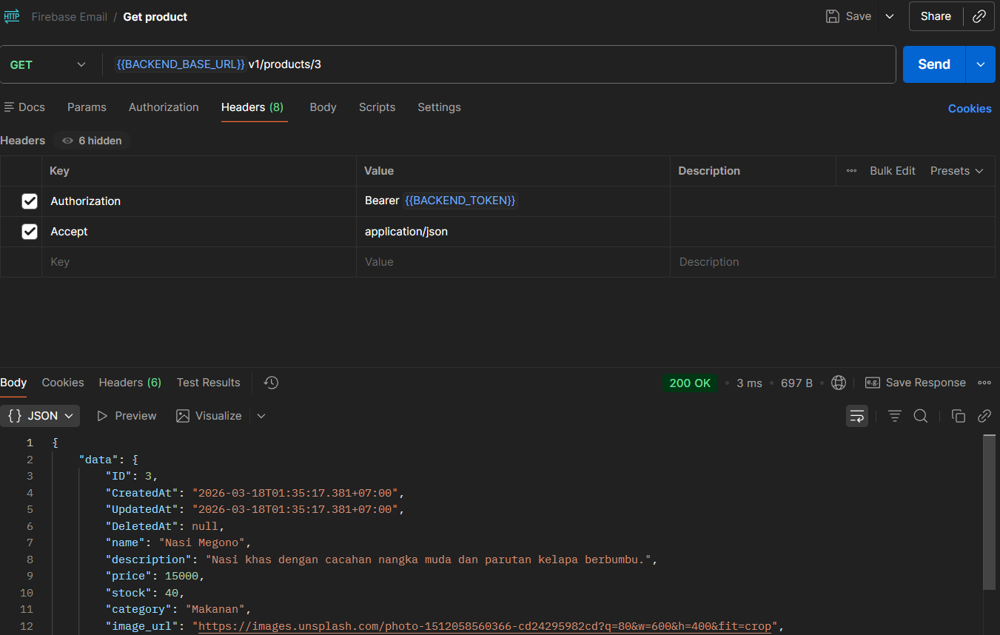
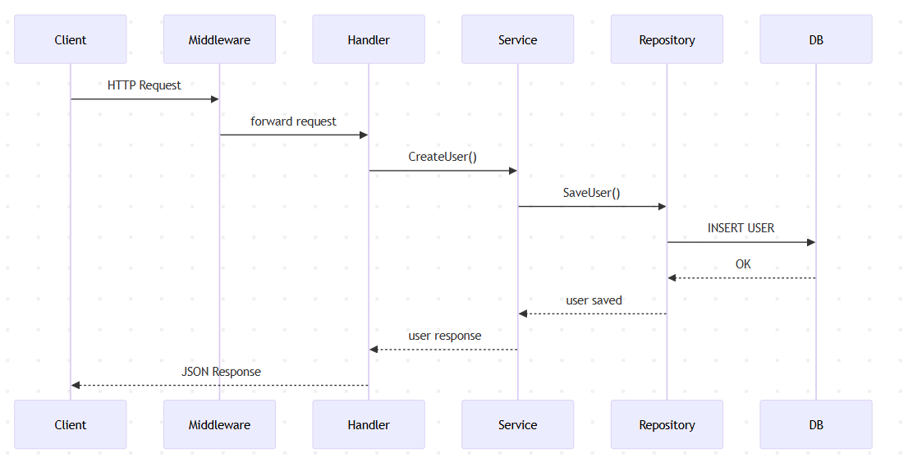

# Testing API Golang with Postman
## Struktur Project
```
catalog_1123150074
│
├── main.go
├── go.mod
├── .env
├── .gitignore
│
├── config
│   ├── database.go
│   └── firebase.go
├── images
│   
│
├── models
│   ├── user.go
│   └── product.go
│
├── middleware
│   └── auth_middleware.go
│
├── handlers
│   ├── auth_handler.go
│   └── product_handler.go
│
├── services
│   ├── auth_service.go
│   └── product_service.go
│
├── repositories
│   ├── user_repository.go
│   └── product_repository.go
│
└── routes
    └── router.go
```


### Penjelasan
| Folder       | Fungsi                                         |
| ------------ | ---------------------------------------------- |
| config       | konfigurasi database dan firebase              |
| models       | struktur data yang terhubung ke tabel database |
| repositories | layer akses database                           |
| services     | business logic aplikasi                        |
| handlers     | menerima HTTP request                          |
| middleware   | autentikasi JWT                                |
| routes       | definisi endpoint API                          |
| images       | image untuk di readme                          |

---

## API Endpoint
Berikut Endpoint yang tersedia pada sistem.
### Health Check
```
GET /v1/health
```


---

### Authentication
```
POST /v1/auth/verify-token
```


---

### Products
```
GET /v1/products
```

```
GET /v1/products/:id
```


---

## Flow User


## Code
```
sequenceDiagram
participant Client
participant Middleware
participant Handler
participant Service
participant Repository
participant DB
Client->>Middleware: HTTP Request
Middleware->>Handler: forward request
Handler->>Service: CreateUser()
Service->>Repository: SaveUser()
Repository->>DB: INSERT USER
DB-->>Repository: OK
Repository-->>Service: user saved
Service-->>Handler: user response
Handler-->>Client: JSON Response
```

---

## Flow Product


## Code
```
sequenceDiagram
participant Client
participant Middleware
participant Handler
participant Service
participant Repository
participant DB

Client->>Middleware: HTTP Request (GET /products)
Middleware->>Handler: forward request
Handler->>Service: GetAllProducts()
Service->>Repository: FindAll()
Repository->>DB: SELECT * FROM products
DB-->>Repository: product list
Repository-->>Service: products data
Service-->>Handler: products response
Handler-->>Client: JSON Response
```
